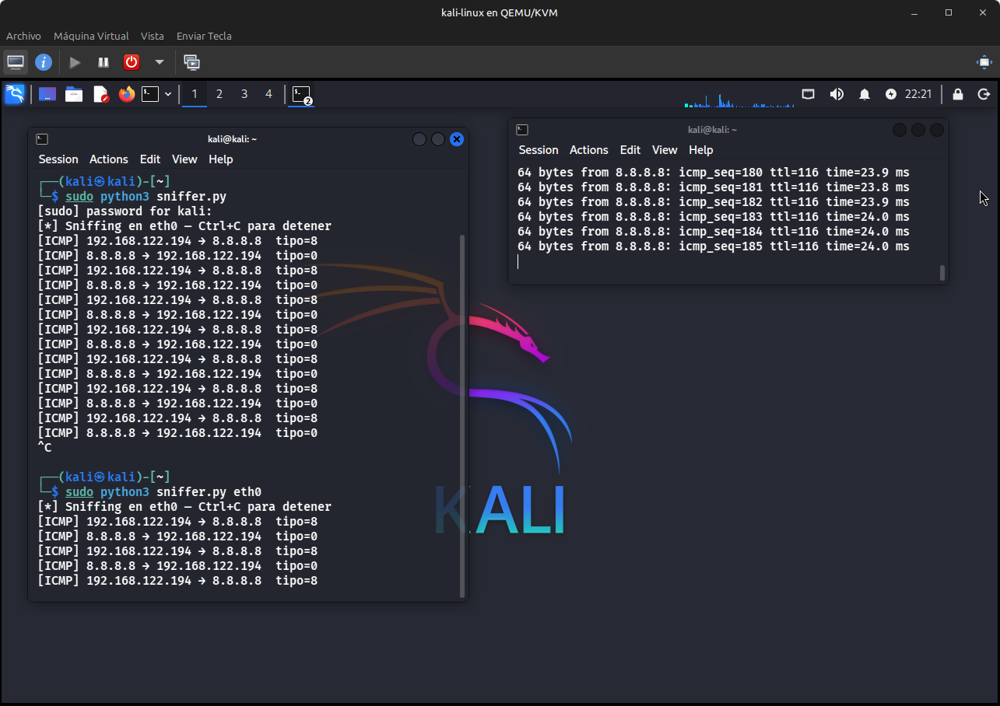
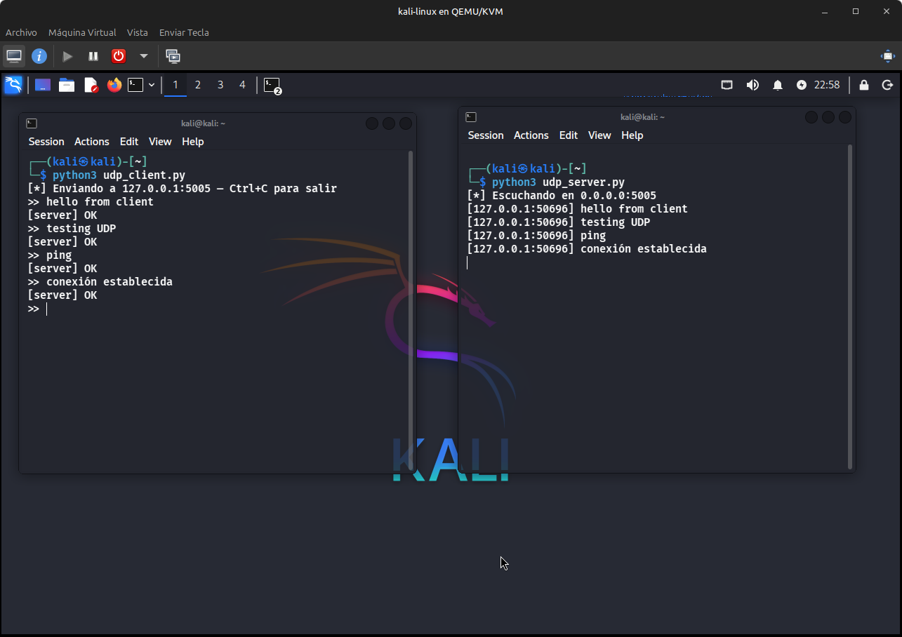

# Networking

Scripts de redes usando sockets a bajo nivel.

## Contenido

| Script          | Descripción                                |
| --------------- | ------------------------------------------ |
| `scanner.py`    | Port scanner TCP con threading             |
| `sniffer.py`    | Sniffer de paquetes TCP/UDP/ICMP con scapy |
| `udp_server.py` | Servidor UDP                               |
| `udp_client.py` | Cliente UDP                                |

## scanner.py


Escanea puertos TCP en un host usando `connect_ex()` y `ThreadPoolExecutor` para correr hasta 100 conexiones en paralelo.

```bash
# Puertos 1-1024 (default)
python3 scanner.py 127.0.0.1

# Rango específico
python3 scanner.py 192.168.122.1 20 100
```

## sniffer.py



Captura paquetes en tiempo real e imprime origen, destino y puerto según el protocolo.

```bash
# Captura indefinida
sudo python3 sniffer.py

# Interfaz específica
sudo python3 sniffer.py eth0

# Capturar N paquetes
sudo python3 sniffer.py eth0 20
```

## udp_client.py / udp_server.py



Comunicación UDP básica entre cliente y servidor. El servidor responde `OK` a cada mensaje recibido.

```bash
# Terminal 1
python3 udp_server.py

# Terminal 2
python3 udp_client.py 127.0.0.1
```

## Dependencias

`scanner.py` — solo librería estándar de Python.  
`sniffer.py` — requiere `scapy` (incluida por defecto en Kali).  
`udp_client.py` / `udp_server.py` — solo librería estándar de Python.
