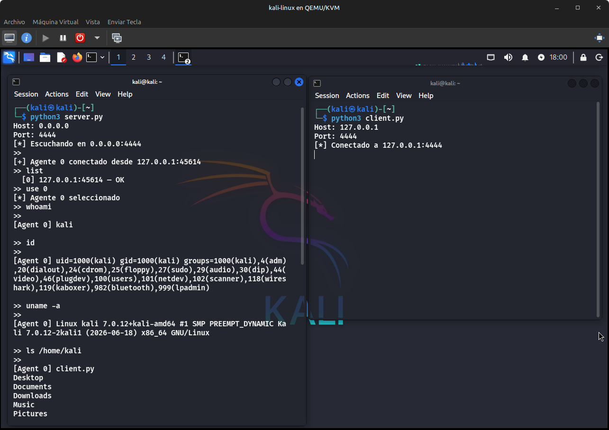
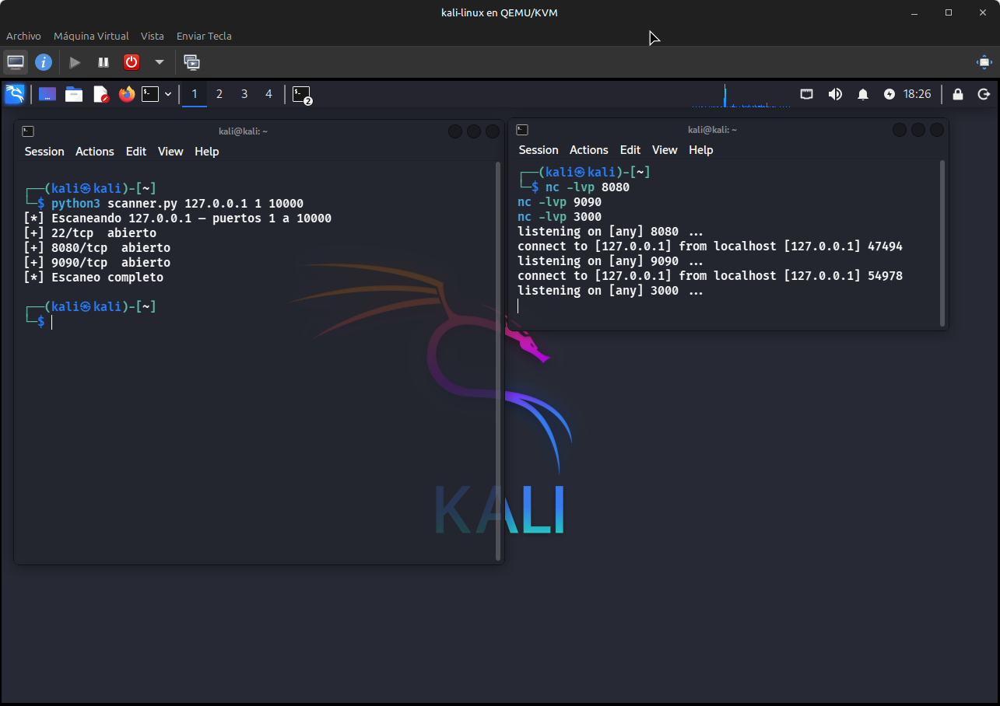

# labs-py

Repositorio de prácticas de ciberseguridad, redes y programación en Python.

## Estructura

```
labs-py/
├── Command-and-Control/
│   ├── assets/
│   ├── client.py
│   ├── server.py
│   └── README.md
│
├── Networking/
│   ├── scanner.py
│   └── README.md
│
├── Enumeration/
│   └── ...
│
└── README.md
```

## Contenido

| Carpeta               | Descripción                                  |
| --------------------- | -------------------------------------------- |
| `Command-and-Control` | C2 básico operador/agente con cifrado Fernet |
| `Networking`          | Port scanner TCP, sniffer, UDP               |
| `Enumeration`         | Scripts de enumeración para laboratorios     |

## Tests





## Conceptos

`Python` `Sockets` `Redes` `Threading` `Protocolos` `Comunicación cliente-servidor` `Automatización` `Enumeración` `Seguridad ofensiva`

## Entornos

- Kali Linux (VM en KVM/QEMU)
- Linux Mint
- Hack The Box

## Disclaimer

Fines exclusivamente educativos. Todo el contenido está desarrollado para entornos controlados y autorizados: Hack The Box, TryHackMe, máquinas virtuales propias y laboratorios locales. No utilizo ni pretendo utilizar este contenido contra sistemas de terceros sin autorización.
